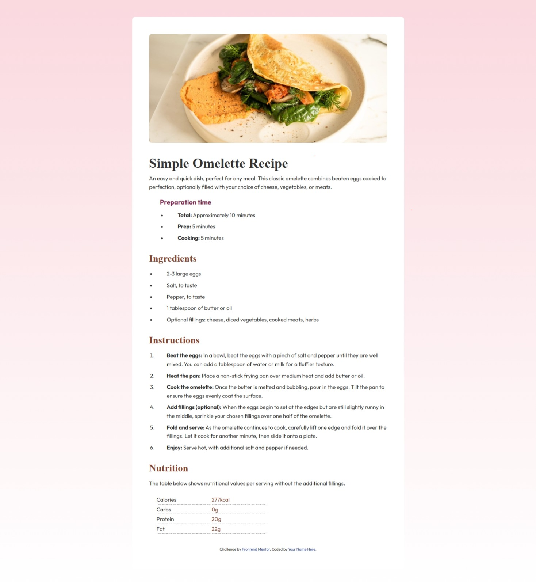

# Frontend Mentor - Recipe page solution

This is a solution to the [Recipe page challenge on Frontend Mentor](https://www.frontendmentor.io/challenges/recipe-page-KiTsR8QQKm). Frontend Mentor challenges help you improve your coding skills by building realistic projects. 

## Table of contents

- [Overview](#overview)
  - [The challenge](#the-challenge)
  - [Screenshot](#screenshot)
  - [Links](#links)
- [My process](#my-process)
  - [Built with](#built-with)
  - [What I learned](#what-i-learned)
  - [Continued development](#continued-development)
  - [Useful resources](#useful-resources)
- [Author](#author)

## Overview

### Screenshot

### Links

- Solution URL: [https://github.com/meckmeier/recipe-page-main](https://github.com/meckmeier/recipe-page-main)
- Live Site URL: [https://meckmeier.github.io/recipe-page-main/](https://meckmeier.github.io/recipe-page-main/)

## My process

### Built with

- Semantic HTML5 markup
- CSS custom properties
- HTML Table
- CSS Grid

### What I learned

I was not very familiar with the html table, and that was the way I went with the small nutrition box at the bottom. I understand from a semantic perspective this is a better choice that the more responsive grid or flexgrid.

If you want more help with writing markdown, we'd recommend checking out [The Markdown Guide](https://www.markdownguide.org/) to learn more.

### Continued development

At this point, each time I build a new page I am reinforcing the stuff I've learned. I can't say how helpful this has been. I am also interesting in understanding more about responsive layouts and using DATA in my web sites - although I believe this will involve more javascript that I've been doing.

### Useful resources

I continue to use : https://developer.mozilla.org/en-US/ for general info on how to use html and css elements.

## Author

- Website - [Mary Eckmeier]
- Frontend Mentor - [@meckmeier](https://www.frontendmentor.io/profile/meckmeier)

